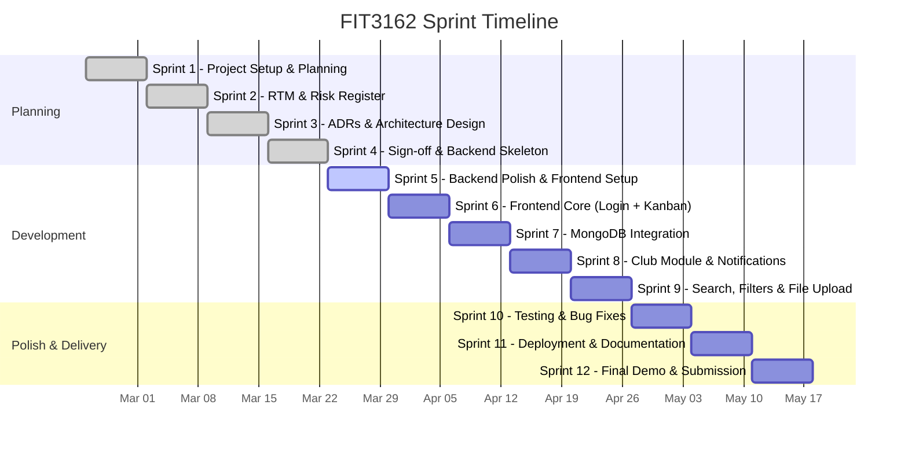

# Project Context — Monash Club Task Manager

## Project Overview

The Monash Club Task Manager is a capstone project for **FIT3162 Computer Science Project Part 2** at Monash University. It helps Monash University clubs plan, assign, track, and review tasks for events and activities. The application provides role-based access control (admin vs member), a Kanban-style task workflow, and an audit trail of actions.

## Objective

Deliver a working full-stack web application that demonstrates software engineering best practices: clean architecture, CI/CD, automated testing, and iterative development over 12 sprints.

## Team Members

| Name | Role |
|------|------|
| Thanh Tung Le | [TO FILL IN] |
| Ruizhi Wang | [TO FILL IN] |
| Ethan Arsabhuvana | [TO FILL IN] |

**Group:** S2_CS_07

## Architecture Summary

**Pattern:** Modular Monolith with Onion (Clean) Architecture

- **Domain Layer (innermost):** Entities, value objects, domain events, repository interfaces. Zero external dependencies.
- **Application Layer:** Use cases / service classes. Defines DTOs. Depends only on Domain.
- **Infrastructure Layer (outermost):** Express routes, database repos, middleware. Depends on Application and Domain.

Dependencies always point inward: Infrastructure → Application → Domain. Never the reverse.

**Modules:** Identity, Task, Club/Event (planned), Notification (planned)

Modules communicate via in-process method calls and a shared event bus.

For full Architecture Decision Records (ADRs), see [docs/PROJECT_SPEC_ORIGINAL.md](PROJECT_SPEC_ORIGINAL.md).

## RTM Summary

| Req | Description | Priority | Status |
|-----|-------------|----------|--------|
| R1 | Admin CRUD tasks | High | Done |
| R2 | Admin assign tasks to members | High | Done |
| R3 | Deadlines and reminders | Medium | Partial |
| R4 | Kanban status view | Medium | Backend done |
| R5 | Categorize/filter/search | Medium | Partial |
| R6 | File attachments | Low | Not started |
| R7 | Role-based access control | High | Done |
| R8 | Responsive design | Medium | Not started |
| R13 | Page load under 3s | High | N/A |

## Risk Register Summary

| Risk | Likelihood | Impact | Mitigation |
|------|-----------|--------|------------|
| Scope creep | High | High | Strict sprint boundaries, RTM-driven prioritisation |
| Team member unavailability | Medium | High | Shared knowledge via docs, pair programming |
| Tech stack learning curve | Medium | Medium | TypeScript + Express chosen for familiarity; new tools introduced incrementally |
| Database migration complexity | Low | Medium | Repository pattern with in-memory stores allows easy swap to MongoDB |
| CI/CD pipeline failures | Low | Medium | Simple GitHub Actions pipeline, tested locally before push |

[TO FILL IN — update with any new risks identified since initial planning]

## Sprint Plan

[TO FILL IN — adjust sprint dates and content based on actual progress]

## Ceremonies and Meeting Cadence

- **Sprint planning:** [TO FILL IN — day/time]
- **Stand-ups:** [TO FILL IN — frequency and format]
- **Sprint review/retrospective:** [TO FILL IN — day/time]
- **Tutor check-in:** [TO FILL IN — day/time]

## Key Decisions Made

1. **Modular Monolith over Microservices** (ADR-001) — 3-person team, 12-week timeline makes microservices overhead prohibitive
2. **Onion Architecture** (ADR-002) — Clean separation of concerns, testable, swappable infrastructure
3. **In-memory repositories first** (ADR-004) — Demonstrates repository pattern; trivial to swap to MongoDB later
4. **Pragmatic events over Event Sourcing** (ADR-005) — CRUD as source of truth + domain events for audit trail and side effects
5. **JWT stateless auth** (ADR-003) — No server-side sessions, ready for containerised deployment
6. **Zod for validation** — Lightweight, TypeScript-native schema validation (chosen over class-validator)

For detailed ADRs and domain model, see [docs/PROJECT_SPEC_ORIGINAL.md](PROJECT_SPEC_ORIGINAL.md).
