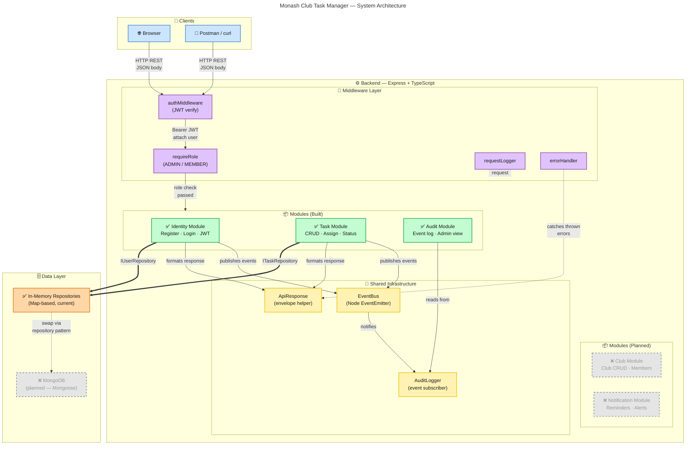

# System Architecture

> Keep this in sync with code changes. Update when adding modules, external services, or infrastructure components.

### Legend

| Colour | Meaning |
|--------|---------|
| 🟦 Light blue | Client / consumer |
| 🟪 Light purple | API routes / middleware |
| 🟩 Light green | Application modules |
| 🟨 Light yellow | Shared / domain services |
| 🟧 Light orange | Data infrastructure |
| ⬜ Grey dashed | Planned / not yet built |
