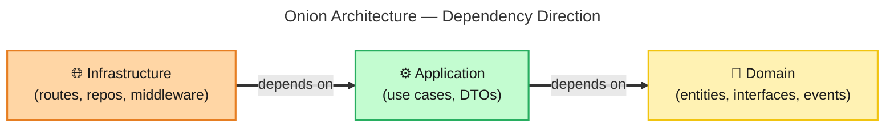
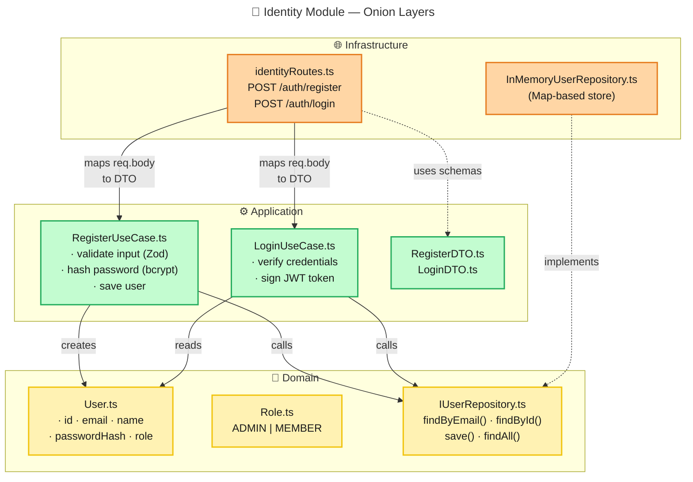
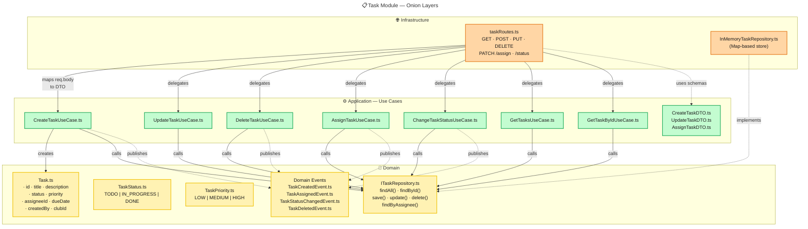
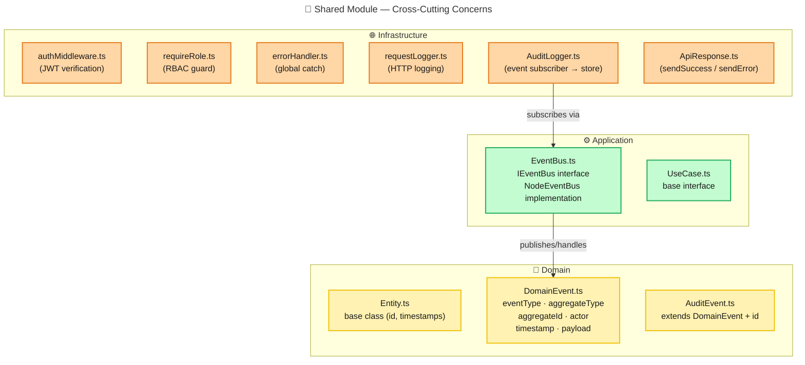

# Backend Module Architecture — Onion Layers

> Keep this in sync with code changes. Update when adding new modules, use cases, or domain entities.

## Dependency Rule

---

## Identity Module

---

## Task Module

---

## Shared Module

