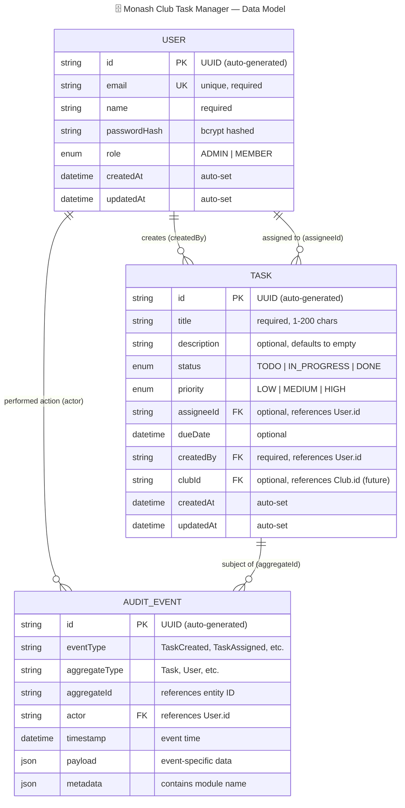

# Database Schema

> Keep this in sync with code changes. Update when entities change, new collections are added, or MongoDB schemas are defined.

**Current storage:** In-memory repositories (Map-based). MongoDB + Mongoose planned for a future sprint.

## Entity Relationship Diagram

## Field Details by Entity

### 🔐 User (Identity Module)

| Field | Type | Source | Notes |
|-------|------|--------|-------|
| `id` | `string` | `Entity` base class | UUID via `uuid` package |
| `email` | `string` | `User.ts` | Unique, used for login lookup |
| `name` | `string` | `User.ts` | Display name |
| `passwordHash` | `string` | `User.ts` | bcrypt hashed, never exposed in API responses |
| `role` | `Role` | `Role.ts` | Enum: `ADMIN`, `MEMBER` |
| `createdAt` | `Date` | `Entity` base class | Set on construction |
| `updatedAt` | `Date` | `Entity` base class | Updated via `touch()` |

### 📋 Task (Task Module)

| Field | Type | Source | Notes |
|-------|------|--------|-------|
| `id` | `string` | `Entity` base class | UUID |
| `title` | `string` | `Task.ts` | Required |
| `description` | `string` | `Task.ts` | Defaults to `""` |
| `status` | `TaskStatus` | `TaskStatus.ts` | Enum: `TODO`, `IN_PROGRESS`, `DONE`. Defaults to `TODO` |
| `priority` | `TaskPriority` | `TaskPriority.ts` | Enum: `LOW`, `MEDIUM`, `HIGH`. Defaults to `MEDIUM` |
| `assigneeId` | `string?` | `Task.ts` | Optional reference to `User.id` |
| `dueDate` | `Date?` | `Task.ts` | Optional |
| `createdBy` | `string` | `Task.ts` | Required reference to `User.id` |
| `clubId` | `string?` | `Task.ts` | Exists but unused until Club module |
| `createdAt` | `Date` | `Entity` base class | |
| `updatedAt` | `Date` | `Entity` base class | |

### 📝 Audit Event (Shared Module)

| Field | Type | Source | Notes |
|-------|------|--------|-------|
| `id` | `string` | `AuditEvent.ts` | UUID added via `toAuditEvent()` |
| `eventType` | `string` | `DomainEvent.ts` | e.g. `TaskCreated`, `TaskAssigned` |
| `aggregateType` | `string` | `DomainEvent.ts` | e.g. `Task`, `User` |
| `aggregateId` | `string` | `DomainEvent.ts` | ID of the affected entity |
| `actor` | `string` | `DomainEvent.ts` | User ID who performed action |
| `timestamp` | `Date` | `DomainEvent.ts` | When event occurred |
| `payload` | `Record<string, unknown>` | `DomainEvent.ts` | Event-specific data |
| `metadata` | `{ module: string }` | `DomainEvent.ts` | Source module name |

## Notes

- No MongoDB schemas or indexes exist yet — all storage is `Map<string, Entity>` in memory.
- Data resets on every server restart; seed data loaded from `src/seed/seedData.ts`.
- When MongoDB is integrated, each entity maps to a Mongoose model with the same structure.
- The `clubId` field on Task and the commented-out `CLUB`/`NOTIFICATION` entities are placeholders for future modules.
