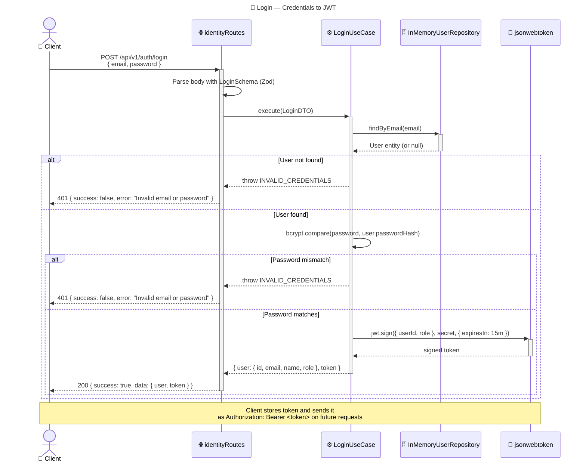

# Request Flow — Sequence Diagrams

> Keep this in sync with code changes. Update when middleware chain, use case logic, or response format changes.

## 1. Login Flow



---

## 2. Create Task

```mermaid
---
title: 📋 Create Task — Full Request Lifecycle
---
sequenceDiagram
    actor C as 👤 Client
    participant R as 🌐 taskRoutes
    participant Auth as 🔐 authMiddleware
    participant RBAC as 🛡️ requireRole(ADMIN)
    participant UC as ⚙️ CreateTaskUseCase
    participant Repo as 🗄️ InMemoryTaskRepository
    participant EB as 📡 EventBus
    participant AL as 📝 AuditLogger

    C->>+Auth: POST /api/v1/tasks<br/>Authorization: Bearer <JWT><br/>{ title, priority, ... }

    activate Auth
    Auth->>Auth: Decode JWT, extract { userId, role }
    Auth->>Auth: Attach auth payload to req
    Auth-->>R: next()
    deactivate Auth

    activate RBAC
    R->>RBAC: Check req.auth.role === ADMIN
    alt Role is not ADMIN
        RBAC-->>C: 403 { success: false, error: "Forbidden" }
    else Role is ADMIN
        RBAC-->>R: next()
    end
    deactivate RBAC

    R->>R: Parse body with CreateTaskSchema (Zod)
    R->>+UC: execute({ ...dto, createdBy: userId })

    activate UC
    UC->>UC: Validate fields
    UC->>UC: new Task({ title, priority, createdBy, ... })
    UC->>+Repo: save(task)
    Repo->>Repo: Store in Map<id, Task>
    Repo-->>-UC: saved Task entity

    UC->>+EB: publish(TaskCreatedEvent)
    EB->>+AL: handle(TaskCreatedEvent)
    AL->>AL: Store audit entry
    deactivate AL
    deactivate EB

    UC-->>-R: Task entity
    deactivate UC

    R-->>-C: 201 { success: true, data: { task } }
```

---

## 3. Assign Task — RBAC Fail then Success

```mermaid
---
title: 📌 Assign Task — RBAC Rejection + Successful Assignment
---
sequenceDiagram
    actor Member as 👤 Team Member
    actor Admin as 👤 Club Admin
    participant R as 🌐 taskRoutes
    participant Auth as 🔐 authMiddleware
    participant RBAC as 🛡️ requireRole(ADMIN)
    participant UC as ⚙️ AssignTaskUseCase
    participant Repo as 🗄️ InMemoryTaskRepository
    participant EB as 📡 EventBus
    participant AL as 📝 AuditLogger

    Note over Member,AL: Attempt 1: Member tries to assign (should fail)

    Member->>+Auth: PATCH /api/v1/tasks/:id/assign<br/>Authorization: Bearer <member-token><br/>{ assigneeId: "user-123" }
    activate Auth
    Auth->>Auth: Decode JWT → role: MEMBER
    Auth-->>R: next()
    deactivate Auth

    activate RBAC
    R->>RBAC: Check role === ADMIN
    RBAC-->>Member: 403 { success: false, error: "Forbidden" }
    deactivate RBAC

    Note over Member,AL: ❌ Rejected — only admins can assign tasks

    Note over Admin,AL: Attempt 2: Admin assigns task (should succeed)

    Admin->>+Auth: PATCH /api/v1/tasks/:id/assign<br/>Authorization: Bearer <admin-token><br/>{ assigneeId: "user-123" }
    activate Auth
    Auth->>Auth: Decode JWT → role: ADMIN
    Auth-->>R: next()
    deactivate Auth

    activate RBAC
    R->>RBAC: Check role === ADMIN
    RBAC-->>R: next()
    deactivate RBAC

    R->>R: Parse body with AssignTaskSchema (Zod)
    R->>+UC: execute({ id, assigneeId, actor })

    activate UC
    UC->>+Repo: findById(taskId)
    Repo-->>-UC: Task entity

    UC->>UC: task.assign(assigneeId)

    UC->>+Repo: update(task)
    Repo-->>-UC: updated Task

    UC->>+EB: publish(TaskAssignedEvent)
    EB->>+AL: handle(TaskAssignedEvent)
    AL->>AL: Store audit entry:<br/>"Task assigned to user-123 by admin"
    deactivate AL
    deactivate EB

    UC-->>-R: updated Task entity
    deactivate UC

    R-->>-Admin: 200 { success: true, data: { task } }

    Note over Admin,AL: ✅ Task assigned — audit trail recorded
```
