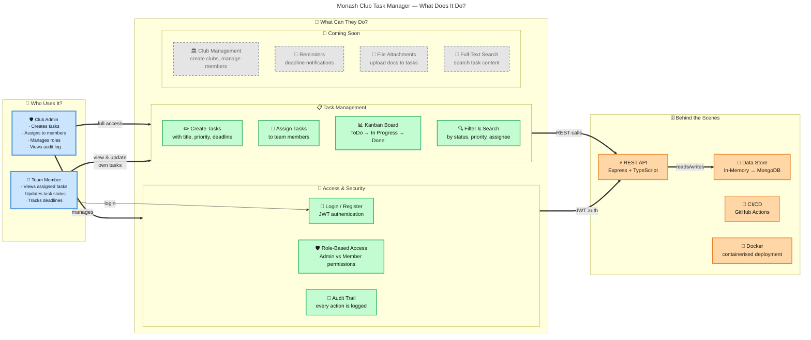

# System Overview — Elevator Pitch

> A one-screen visual for tutors, stakeholders, and teammates. Shows what the app does, not how it's built.

### Quick Facts

| | |
|---|---|
| **What** | Task management app for Monash University student clubs |
| **Who** | Club admins create and assign tasks; members track and complete them |
| **Why** | Clubs need a simple way to organise events, delegate work, and track progress |
| **How** | Web app with Kanban board, role-based access, and audit logging |
| **Status** | Backend complete, frontend in development |

### RTM Feature Map

| Feature | RTM | Status |
|---------|-----|--------|
| ✏️ Create / Edit / Delete Tasks | R1 | ✅ Done |
| 📌 Assign Tasks to Members | R2 | ✅ Done |
| 📅 Deadlines | R3 | 🚧 Stored, no reminders yet |
| 📊 Kanban Status View | R4 | 🚧 Backend done, needs UI |
| 🔍 Filter & Search | R5 | 🚧 Filters done, no full-text |
| 📎 File Attachments | R6 | ❌ Not started |
| 🛡️ Role-Based Access | R7 | ✅ Done |
| 📱 Responsive Design | R8 | ❌ Not started |
| ⚡ Page Load < 3s | R13 | ❌ Pending frontend |
